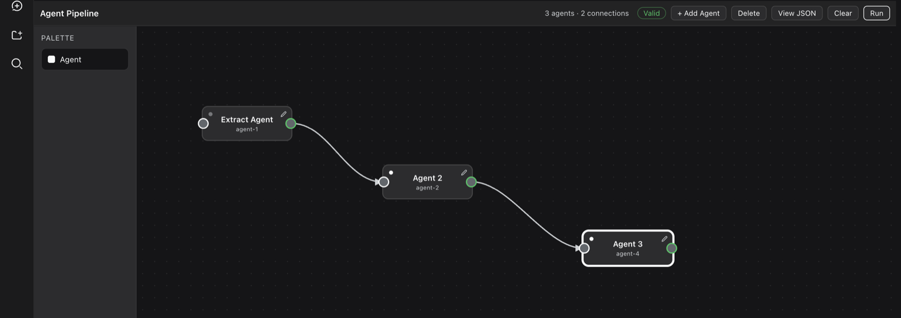

<p align="center">
  <picture>
    <source media="(prefers-color-scheme: dark)" srcset="https://shieldcn.dev/header/graph.svg?title=Agent+Pipeline+Canvas&subtitle=Visual+agent-pipeline+canvas+for+DSH+Web&logo=ri:flow-chart&mode=dark" />
    
  </picture>
</p>

<p align="center">
  <a href="./LICENSE"></a>
  <a href="https://github.com/ivbrajkovic/dsh-agent-pipeline-canvas/stargazers"></a>
  <a href="https://github.com/ivbrajkovic/dsh-agent-pipeline-canvas/commits"></a>
  <a href="https://www.typescriptlang.org"></a>
  <a href="https://nodejs.org"></a>
  <a href="https://github.com/ivbrajkovic/dsh-agent-pipeline-canvas/blob/main/package.json"></a>
</p>

---

**dsh-agent-pipeline-canvas** is a local DSH Web composition plugin: a visual
**agent-pipeline** canvas in every session — a **Pipelines** view tab, plus a
composer button that works even on a brand-new session. Build a DAG of
generic agents, then run it: each agent is delegated to the harness's own
`subagents` service in deterministic topological order, outputs flow
downstream, and the durable run returns
`{ outputs: { [terminalId]: output } }`. The graph persists per repository.

<p align="center">
  
</p>

## What it does

- **Visual DAG editor** — drag agents onto the canvas, wire outputs to
  inputs (fan-out and fan-in), get live DAG validation as you edit.
- **Per-agent configuration** — system prompt (the harness persona slot),
  provider/model/reasoning/tokens, tool filter, delegation-depth cap, and an
  output schema; empty fields inherit the parent session.
- **Durable runs** — a run executes in the Host process, survives page
  reloads and profile restarts, and streams its progress over SSE; one run
  is active per workspace.
- **Breakpoints** — pause any agent after its output settles, then inspect
  and **resume**, **rerun** from the original input, **steer** the same
  child with feedback, or **abort** — all across restarts.
- **Results that go somewhere** — continue in chat, in a new session, or in
  any workspace session; nothing is ever auto-sent.
- **Zero runtime dependencies** — three faces (Host routes, React client,
  pure core) over one shared validation/execution contract.

Deliberately not implemented yet: parallel execution, retries, conditions,
loops, live visualization. The executor is sequential by design.

## Documentation

The full manual lives in [docs/index.md](docs/index.md). Read what you need:

| Document | Covers |
|----------|--------|
| [docs/guide/canvas.md](docs/guide/canvas.md) | Building pipelines: nodes, ports, connections, validation, the configuration panel, persistence. |
| [docs/guide/running-pipelines.md](docs/guide/running-pipelines.md) | The run dialog, durable runs and SSE, breakpoints (resume / rerun / steer / abort), results and continue routes. |
| [docs/guide/deployment.md](docs/guide/deployment.md) | Profile wiring, the sync loop, route verification, dev scripts and change discipline. |
| [docs/reference/architecture.md](docs/reference/architecture.md) | Host routes, browser slots and bundling, the pure core, project layout. |
| [docs/reference/graph-and-execution.md](docs/reference/graph-and-execution.md) | The graph schema, every validation error code, and the execution contract. |
| [docs/reference/system-prompt.md](docs/reference/system-prompt.md) | The harness system-prompt section layout and the persona slot an agent's system prompt replaces. |

## Install & deploy

Copy-deployed into the local DSH web profile at
`~/.dsh/profiles/web/node_modules/dsh-agent-pipeline-canvas/`. One-time
wiring:

1. Add to `~/.dsh/profiles/web/package.json`:

   ```json
   "dsh-agent-pipeline-canvas": "file:../../../Desktop/agent-pipeline/dsh-agent-pipeline-canvas"
   ```

2. Add the plugin row to `~/.dsh/profiles/web/cordis.patch.yml`:

   ```yaml
   - id: agent-pipeline-canvas
     name: dsh-agent-pipeline-canvas
   ```

Then after every change:

```
npm run sync   # typecheck + test + build + rsync into the profile
```

Client-only changes need a hard browser refresh; host changes need a profile
restart. Details, caveats, and route verification:
[docs/guide/deployment.md](docs/guide/deployment.md).

## Development

```
npm run typecheck   # tsc -p tsconfig.json (whole tree, noEmit)
npm test            # plain tsx scripts: validate + execution + message + runner + runs
npm run build       # tsc -p tsconfig.build.json && tsdown → lib/
```

`lib/` is committed build output — rebuild, never hand-edit. Change
discipline and conventions: [docs/guide/deployment.md](docs/guide/deployment.md).

## License

[MIT](./LICENSE).
